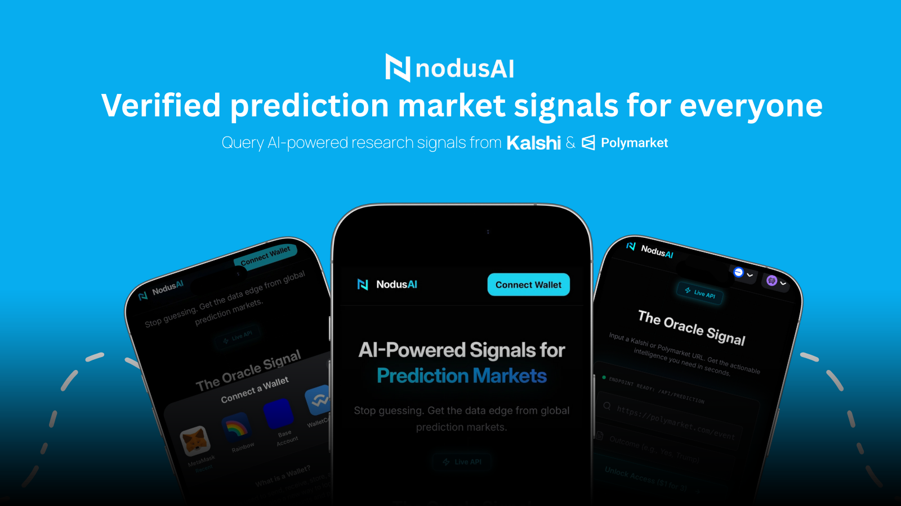

# NodusAI MCP Server

> AI-Powered Signals for Prediction Markets — accessible to any AI agent via MCP.

AI agents connect to this server to get Oracle signals for [Polymarket](https://polymarket.com) and [Kalshi](https://kalshi.com) prediction markets. Signals are generated by Gemini 2.5 Flash with real-time web grounding.

<a href="https://glama.ai/mcp/servers/NodusAI-Your-Prediction-Broker/nodusai-mcp-server">
  
</a>

---

## How it works

```
Agent → nodusai.app → connect wallet → pay $1 USDC → get session token
                                                              ↓
Agent → MCP Server (nodus_get_signal) → nodusai.app/api/prediction → signal
```

1. Visit **[nodusai.app](https://nodusai.app)** and connect your wallet
2. Paste a Polymarket or Kalshi market URL
3. (Optional) Add your desired outcome (YES / NO)
4. Pay $1 USDC — confirmed on-chain
5. Get a **session token** good for 3 queries
6. Use the session token with `nodus_get_signal` in any MCP client

---

## Payment model

- **Cost:** $1 USDC = 3 Oracle signal queries
- **Networks:** Base, Ethereum, Avalanche (any EVM chain)
- **Token:** USDC
- **Non-custodial:** payments go directly on-chain via nodusai.app
- **Session:** one payment = one session token = 3 queries (24h validity)

---

## Available tools

| Tool | Description |
|------|-------------|
| `nodus_pricing` | View pricing and how to get a session token |
| `nodus_get_signal` | **Get an Oracle signal using your session token** |
| `nodus_verify_signal` | Audit grounding sources of a past signal |
| `nodus_query_history` | Your recent query history |
| `nodus_admin_stats` | Platform-wide stats (admin) |
| `nodus_admin_queries` | Full query registry dump (admin) |

---

## Signal format

Every Oracle response follows NodusAI's structured schema:

```json
{
  "market_name": "Will the Fed cut rates in June 2026?",
  "predicted_outcome": "YES",
  "probability": 0.73,
  "confidence_score": "HIGH",
  "key_reasoning": "Recent FOMC minutes and inflation data suggest...",
  "grounding_sources": [
    { "title": "Reuters: Fed signals rate path", "url": "https://..." },
    { "title": "AP: CPI data June 2026", "url": "https://..." }
  ]
}
```

---

## Deploy in 5 minutes

### Option 1 — Railway (recommended)

1. Fork this repo on GitHub
2. Go to [railway.app](https://railway.app) → **New Project** → **Deploy from GitHub repo**
3. Select your fork
4. Add environment variable: `NODUSAI_API_BASE` = `https://nodusai.app`
5. Railway auto-detects `railway.json` and deploys
6. Copy your Railway URL

---

### Option 2 — Render (free tier)

1. Fork this repo
2. Go to [render.com](https://render.com) → **New Web Service** → connect your fork
3. Set **Build command:** `npm install` and **Start command:** `node src/server-http.js`
4. Add env var: `NODUSAI_API_BASE=https://nodusai.app`

---

### Option 3 — Fly.io

```bash
fly launch --name nodusai-mcp
fly secrets set NODUSAI_API_BASE=https://nodusai.app
fly deploy
```

---

## Connect AI agents

### Claude Desktop

File: `~/Library/Application Support/Claude/claude_desktop_config.json`

```json
{
  "mcpServers": {
    "nodusai": {
      "url": "https://nodusai-mcp-production.up.railway.app/sse"
    }
  }
}
```

---

### Cursor

File: `~/.cursor/mcp.json`

```json
{
  "mcpServers": {
    "nodusai": {
      "url": "https://nodusai-mcp-production.up.railway.app/sse",
      "transport": "sse"
    }
  }
}
```

---

### Windsurf

File: `~/.codeium/windsurf/mcp_config.json`

```json
{
  "mcpServers": {
    "nodusai": {
      "serverUrl": "https://nodusai-mcp-production.up.railway.app/sse"
    }
  }
}
```

---

### Claude Code (CLI)

```bash
claude mcp add --transport sse nodusai https://nodusai-mcp-production.up.railway.app/sse
```

---

### Custom JS agent

```javascript
import { Client } from "@modelcontextprotocol/sdk/client/index.js";
import { SSEClientTransport } from "@modelcontextprotocol/sdk/client/sse.js";

const client = new Client({ name: "my-agent", version: "1.0.0" }, { capabilities: {} });
await client.connect(new SSEClientTransport(new URL("https://nodusai-mcp-production.up.railway.app/sse")));

// Step 1 — get a session token at https://nodusai.app ($1 USDC)

// Step 2 — query the Oracle
const result = await client.callTool({
  name: "nodus_get_signal",
  arguments: {
    marketUrl:      "https://polymarket.com/event/...",
    sessionToken:   "your-session-token-from-nodusai.app",
    desiredOutcome: "YES", // optional
  }
});
```

---

### Custom Python agent

```python
from mcp.client.sse import sse_client
from mcp import ClientSession

async with sse_client("https://nodusai-mcp-production.up.railway.app/sse") as (read, write):
    async with ClientSession(read, write) as session:
        await session.initialize()

        # Get a session token at https://nodusai.app first ($1 USDC)
        result = await session.call_tool("nodus_get_signal", {
            "marketUrl":      "https://kalshi.com/markets/...",
            "sessionToken":   "your-session-token-from-nodusai.app",
            "desiredOutcome": "YES",  # optional
        })
```

---

## Local development

```bash
git clone https://github.com/NodusAI-Your-Prediction-Broker/nodusai-mcp
cd nodusai-mcp
npm install

# Dev mode (mock oracle — no real API calls needed)
npm run dev:http
```

Test with:
```bash
curl http://localhost:3000/health
curl http://localhost:3000/info
```